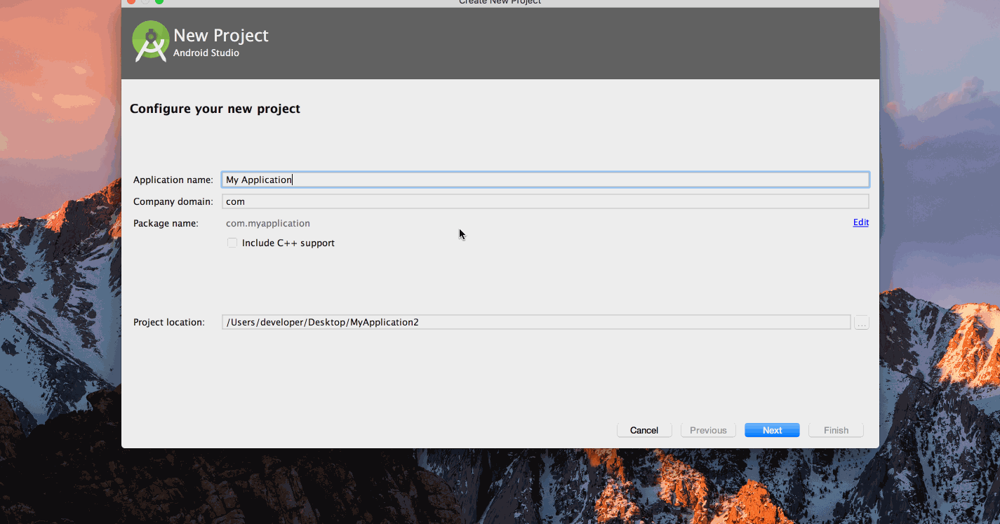

# AndroidTemplates
扩充AndroidStudio中Templates

# 导入路径
mac : /Applications/Android Studio.app/Contents/plugins/android/lib/templates/activities/

windows : AndroidStudio安装目录\plugins\android\lib\templates

# 使用方式

直接下载 ShoppingActivity -> 放入系统目录中->使用

